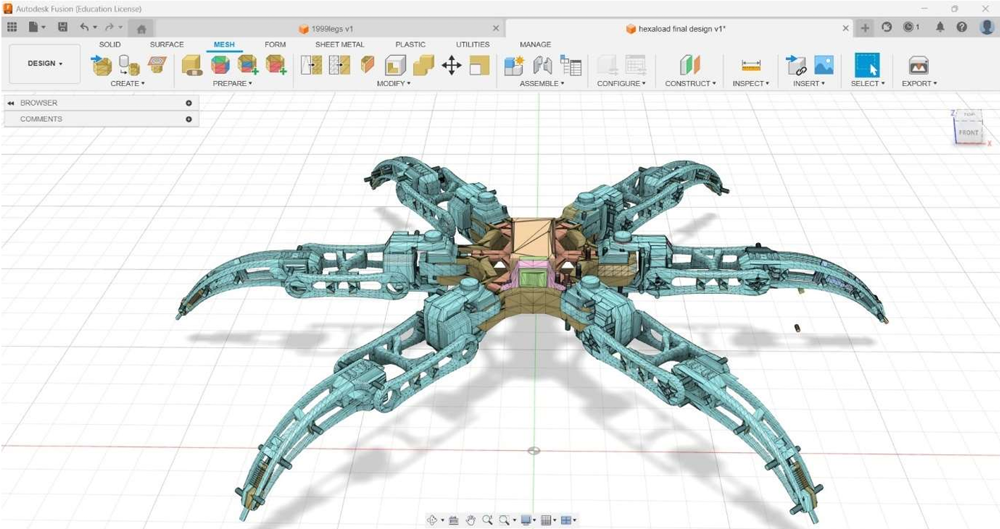
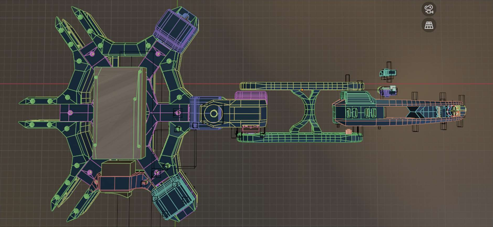
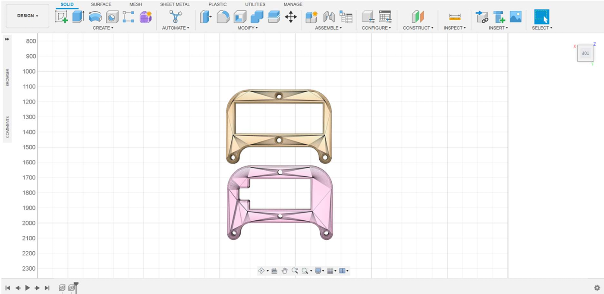
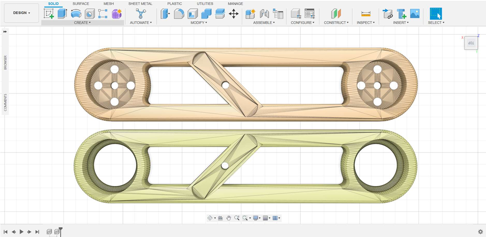
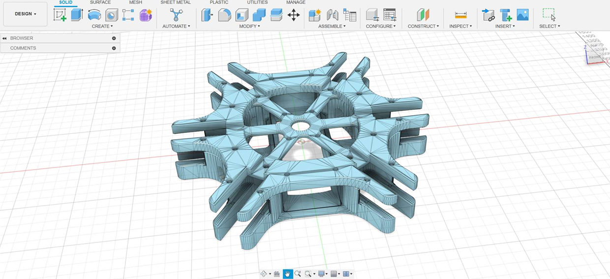
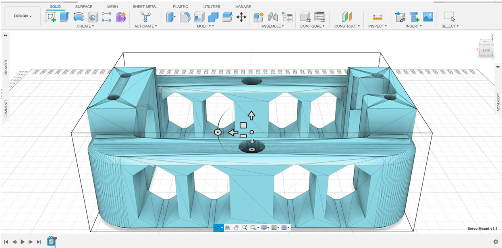
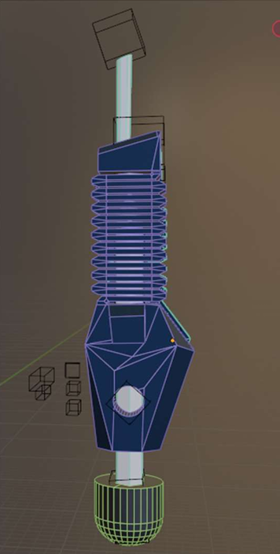
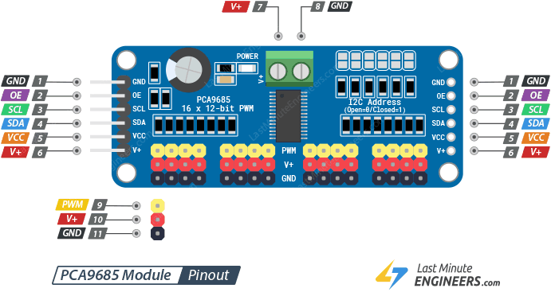
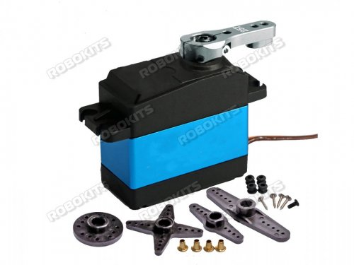

<div align="center">

# 🕷️ HexaBot

### Six-Legged Load Carrying Robot for Rough Terrain Navigation

<p align="center">

</p>

[]
[]
[]
[]
[]

A biologically inspired six-legged robotic platform designed for stable locomotion over rough terrain. The project focuses on developing a modular, load-carrying hexapod capable of navigating environments where conventional wheeled vehicles cannot operate.

</div>

---

# 📖 Introduction

Mountainous regions, forests, disaster-affected areas and rugged terrain remain difficult to access using conventional wheeled vehicles. Transportation in such environments often depends on manual labour or pack animals, which may not always provide a safe or reliable solution.

**HexaBot** is developed to address this challenge by providing a stable six-legged robotic platform capable of traversing uneven terrain while carrying loads. Inspired by the locomotion of insects, the robot maintains stability by keeping multiple legs in contact with the ground during movement. The long-term vision is to create a reliable robotic platform for transportation, inspection and exploration in difficult environments. :contentReference[oaicite:0]{index=0}

---

# ❗ Problem Statement

Traditional vehicles are ineffective in rocky, mountainous and inaccessible terrain. Existing transportation methods often rely on animals such as mules, which raises concerns regarding safety, reliability and operational efficiency.

The objective of this project is to develop a six-legged robotic platform capable of navigating rough terrain while carrying loads, reducing dependency on animals and improving transportation in hazardous environments. The original project vision also considers applications such as mountainous regions where ropeways or roads are unavailable. :contentReference[oaicite:1]{index=1}

---

# 🎯 Objectives

- Develop a stable six-legged walking robot.
- Design a lightweight and modular mechanical structure.
- Implement smooth multi-servo motion control.
- Achieve reliable locomotion on rough terrain.
- Develop a scalable electronics platform.
- Build a prototype suitable for future autonomous navigation.

---

# 🌍 Applications

- Mountain logistics
- Load transportation
- Search and rescue
- Disaster response
- Agricultural assistance
- Industrial inspection
- Research and education
- Defence and surveillance

---

# ✨ Features

- 18 Degrees of Freedom (DOF)
- Six independently actuated legs
- Modular mechanical architecture
- High torque servo actuation
- ESP8266 based embedded controller
- PCA9685 PWM servo driver
- Fusion 360 CAD design
- Expandable sensor platform
- Future battery-powered operation
- Designed for uneven terrain locomotion

---

# 📊 Robot Specifications

| Parameter | Specification |
|-----------|---------------|
| Robot Type | Hexapod |
| Degrees of Freedom | 18 |
| Number of Legs | 6 |
| Servo Motors | 18 × RKI1203 (35 kg·cm) |
| Controller | ESP8266 NodeMCU |
| Servo Driver | PCA9685 |
| Current Power Source | 8.4 V SMPS |
| Future Power Source | 2S Li-ion Battery |
| Weight (Without Battery) | 3.1 kg |
| Weight (With Battery) | 3.4 kg |
| CAD Software | Fusion 360 |

---

# 🏗 Mechanical Design

The robot consists of a modular body with six identical legs. Each leg provides three degrees of freedom through the **Coxa**, **Femur**, and **Tibia** joints. This configuration enables stable walking while maintaining a balanced center of gravity.

The modular design allows damaged components to be replaced individually without disassembling the complete robot.

<p align="center">

</p>

---

## Leg Structure

Each leg consists of:

- Coxa
- Femur
- Tibia

```
Body
 │
 ├── Coxa
 │
 ├── Femur
 │
 └── Tibia
```

```
6 Legs × 3 DOF = 18 DOF
```

<p align="center">



</p>

---

## Trunk Body

The trunk forms the central structure of the robot and supports all six legs while housing the electronic components. Proper weight distribution of the trunk is essential for maintaining walking stability.

<p align="center">

</p>

---

## Servo Mount

A custom servo holder was designed in Fusion 360 to securely mount each servo while maintaining accurate alignment of the joints.

<p align="center">

</p>

---

## Shock Absorbing Foot

The robot incorporates a custom-designed shock absorbing foot to improve grip and reduce impact forces while climbing rocks and uneven terrain. This feature improves stability during locomotion. :contentReference[oaicite:2]{index=2}

<p align="center">

</p>

---

# ⚡ Electronics Architecture

The robot is controlled using an **ESP8266 NodeMCU**, which communicates with the **PCA9685 PWM Servo Driver** through the I²C bus. The PCA9685 generates synchronized PWM signals for all 18 servo motors, significantly reducing the processing load on the controller.

The prototype currently operates using an external **8.4 V SMPS**, while a portable **2S Li-ion battery** is planned for future versions.

```text
ESP8266
     │
   I²C Bus
     │
PCA9685 Driver
     │
18 Servo Motors
     │
Hexapod Motion
```

<p align="center">



</p>
---

# 💻 Software Architecture

The firmware is responsible for generating smooth walking motions by converting desired body movements into servo angles using inverse kinematics. Each walking cycle consists of initialization, gait generation, angle calculation and synchronized PWM output.

```text
Power ON
      │
Initialization
      │
Servo Calibration
      │
Stand Position
      │
Gait Generation
      │
Inverse Kinematics
      │
Servo Angle Calculation
      │
PWM Generation
      │
Robot Movement
```

---

# 🚶 Walking Modes

The robot is designed to support multiple locomotion patterns for different terrains and operational requirements.

- Stand
- Sit
- Move Forward
- Move Backward
- Turn Left
- Turn Right
- Crab Walk
- Tripod Gait
- Ripple Gait (Future)
- Wave Gait (Future)

---

# 🧮 Kinematics

The movement of each leg is based on Forward and Inverse Kinematics.

- **Forward Kinematics** determines the position of the foot from known joint angles.
- **Inverse Kinematics** calculates the required joint angles to place the foot at a desired position.

Each leg consists of three links:

- Coxa
- Femur
- Tibia

The robot maintains stability by ensuring that at least three legs remain in contact with the ground during locomotion. This enables stable movement over uneven terrain. :contentReference[oaicite:0]{index=0} :contentReference[oaicite:1]{index=1}

---

# 🔋 Power System

### Current Prototype

```text
AC Supply
      │
8.4V SMPS
      │
Power Distribution
      │
PCA9685
      │
18 Servo Motors
```

### Future Portable Version

```text
2S Li-ion Battery
        │
      Fuse
        │
 Buck Converter
        │
 ESP8266 + PCA9685
        │
 Servo Motors
```

---

# 📁 Repository Structure

```text
HexaBot
│
├── firmware
│   ├── esp8266
│   ├── stm32
│   └── pca9685
│
├── cad
│   ├── Fusion360
│   ├── STL
│   └── Drawings
│
├── hardware
│   ├── Schematics
│   └── Wiring
│
├── docs
│   ├── Mechanical.md
│   ├── Electronics.md
│   ├── Kinematics.md
│   └── Software.md
│
├── images
├── videos
├── report
├── README.md
└── LICENSE
```

---

# 📈 Current Development Status

| Module | Status |
|---------|:------:|
| CAD Design | ✅ |
| Mechanical Design | ✅ |
| Chassis Assembly | ✅ |
| Servo Installation | ✅ |
| ESP8266 Firmware | 🟡 |
| PCA9685 Integration | 🟡 |
| Servo Calibration | 🟡 |
| Walking Algorithm | 🟡 |
| Wireless Control | 🔜 |
| Battery Operation | 🔜 |
| Sensor Integration | 🔜 |
| Autonomous Navigation | 🔜 |

Legend:

- ✅ Completed
- 🟡 In Progress
- 🔜 Planned

---

# 🚀 Future Improvements

The current prototype establishes the mechanical and embedded control platform for the robot. Future development will focus on improving intelligence, autonomy and field deployment.

Planned improvements include:

- IMU-based body stabilization
- Ultrasonic obstacle detection
- GPS-assisted navigation
- Wireless remote controller
- Battery-powered operation
- Terrain adaptive gait generation
- Camera integration
- Autonomous navigation
- ROS 2 compatibility

---

# 📸 Project Gallery

## Complete Robot

<p align="center">

</p>

---

## Mechanical Components

<p align="center">


</p>

---

## Electronics

<p align="center">


</p>

---

## Foot Mechanism

<p align="center">

</p>

---

# 🎥 Demonstration

A demonstration video showing servo calibration, standing posture and walking gaits will be uploaded after successful gait implementation.


<p align="center">
  <a href="videos/hexabot_demo.mp4">
    
  </a>
</p>

<p align="center">
Click the animation to watch the full demonstration video.
</p>


---

# 🏆 Project Highlights

- 18 Degrees of Freedom
- Modular Mechanical Design
- High Torque Servo Actuation
- Fusion 360 CAD Model
- ESP8266 Embedded Controller
- PCA9685 Servo Driver
- Expandable Electronics Platform
- Rough Terrain Navigation
- Stable Multi-Leg Locomotion
- Designed for Load Carrying Applications

---

# 🤝 Contributing

Contributions are welcome.

If you would like to improve the project:

1. Fork the repository.
2. Create a feature branch.
3. Commit your changes.
4. Submit a Pull Request.

---

# 👨‍💻 Author

**Mallah Tejas Rajkumar**

Electronics and Communication Engineering

Government Engineering College, Bharuch

---

# 📜 License

This project is released under the **MIT License**.

---

<div align="center">

### ⭐ If you found this project interesting, consider giving it a Star!

**Thank you for visiting the HexaBot repository.**

</div>
